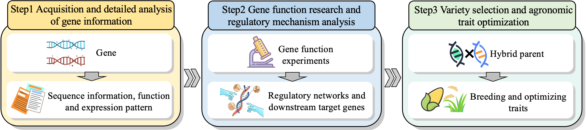
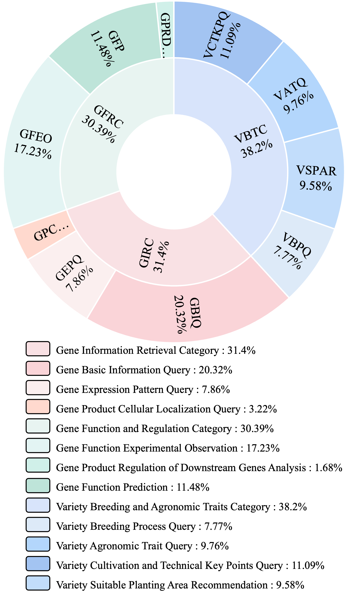
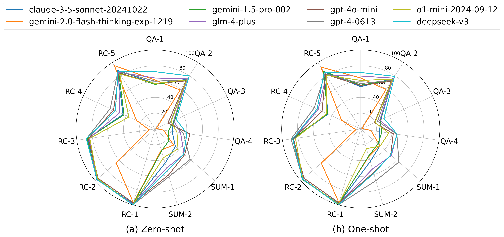
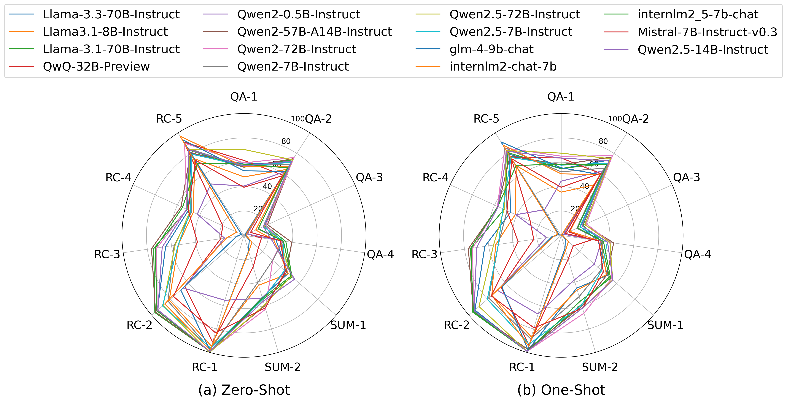

# SeedBench: A Multi-task Benchmark for Evaluating Large Language Models in Seed Science

**SeedBench** is the first multi-task benchmark designed to evaluate large language models (LLMs) in seed science, focusing on seed breeding. This repository includes the dataset, evaluation code, and documentation to support research in this domain.

---

## 🌾 Overview

SeedBench assesses LLMs across three core seed breeding stages:
- **Gene Information Retrieval**
- **Gene Function and Regulation Analysis**
- **Variety Breeding with Agronomic Trait Optimization**

  
*Breeding Expert Workflow Framework*

Built with domain experts, SeedBench features **2,264 expert-validated questions** across 11 task types and 10 subcategories, initially targeting rice breeding. Future updates will include other crops like maize, soybean, and wheat.

## 🔎 Dataset Details

- **Corpus**: 308,727 publications cleaned to 1.1 billion tokens; 279 segments from 113 documents.
- **Questions**: 2,264 across 11 task types, bilingual (English/Chinese), expert-validated.
- **Focus**: Rice breeding as a representative case.

  **Types and metrics:**


  <div align="center">

  | Type ID | Question Type              | Metric   | Count |
  |---------|----------------------------|----------|-------|
  | **Q&A** |                            |          |       |
  | QA-1    | Multiple Choice            | Accuracy | 200   |
  | QA-2    | Multiple Answer            | Macro-F1 | 187   |
  | QA-3    | Fill-in-the-Blank          | ROUGE-L  | 224   |
  | QA-4    | Generation                 | ROUGE-L  | 242   |
  | **Summarization** |                  |          |       |
  | SUM-1   | Simple Summarization       | ROUGE-L  | 225   |
  | SUM-2   | Key Information Extraction | ROUGE-L  | 225   |
  | **Reading Comprehension** |          |          |       |
  | RC-1    | Multiple Choice            | Accuracy | 113   |
  | RC-2    | Multiple Answer            | Macro-F1 | 108   |
  | RC-3    | Fill-in-the-Blank          | ROUGE-L  | 221   |
  | RC-4    | Generation                 | ROUGE-L  | 240   |
  | RC-5    | Subcategory Classification | Accuracy | 279   |

  </div>

  **Taxonomy Distribution:**

  <div align="center">
      
  </div>

## ☀️ Key Results

We evaluated 26 LLMs, including proprietary, open-source, and domain-specific models. Highlights:

### Performance by Question Type

- **Top Performers**: DeepSeek-V3 (68.37), GPT-4 (67.88).

    

    


### Performance by Task Types

| Model            | QA-1 | QA-2 | QA-3 | QA-4 | SUM-1 | SUM-2 | RC-1 | RC-2 | RC-3 | RC-4 | RC-5 | Avg  |
|------------------|------|------|------|------|-------|-------|------|------|------|------|------|------|
| GPT-4           | 60.50| 73.87| 21.35| 36.07| 58.73 | 62.89 | 100.00| 96.44| 87.86| 62.29| 86.74| 67.88|
| DeepSeek-V3     | 72.50| 79.84| 29.29| 40.63| 48.06 | 54.67 | 100.00| 97.22| 87.89| 55.19| 86.74| 68.37|
| Qwen2-72B       | 59.50| 75.98| 19.55| 31.62| 31.08 | 63.09 | 99.12 | 94.24| 72.20| 51.58| 89.96| 62.54|

### Performance by Subcategory

| Model             | C1   | C2   | C3   | C4   | C5   | C6   | C7   | C8   | C9   | C10  | Avg  |
|-------------------|------|------|------|------|------|------|------|------|------|------|------|
| GPT-4            | 59.59| 60.55| 76.32| 61.16| 56.34| 59.35| 63.67| 64.74| 60.65| 67.66| 62.06|
| DeepSeek-V3-671B | 56.03| 62.42| 74.81| 63.17| 55.23| 58.84| 68.23| 69.04| 66.46| 68.48| 63.30|
| Qwen2-72B        | 51.16| 58.10| 74.07| 59.72| 51.58| 57.76| 58.85| 61.63| 56.69| 59.11| 57.62|

- **Top Performers**: DeepSeek-V3-671B (63.30), GPT-4 (62.06).

## 🐝 Repository Contents

- `base_model_eval/`: Used to test base models without dialogue capabilities, i.e., evaluating performance after pretraining.
- `sft_model_eval/`: Used to test SFT (Supervised Fine-Tuning) models, with a total of 2,264 questions covering 10 subcategories (see Fig 2).
  - `one-shot/`: Organized by 11 task types (see Tab 1).
  - `zero-shot/`: Organized by 11 task types (see Tab 1).
- `corpus/`: 279 high-quality text segments and low-quality questions discarded after expert validation.
- `README.md`: This file.

## 📬 Cite

Open an issue on this repository for questions or contributions.

```txt
@article{ying2025seedbench,
  title={SeedBench: A Multi-task Benchmark for Evaluating Large Language Models in Seed Science},
  author={Ying, Jie and Chen, Zihong and Wang, Zhefan and Jiang, Wanli and Wang, Chenyang and Yuan, Zhonghang and Su, Haoyang and Kong, Huanjun and Yang, Fan and Dong, Nanqing},
  journal={arXiv preprint arXiv:2505.13220},
  year={2025}
}
```
```txt
@inproceedings{ying2025seedbench,
    title={SeedBench: A Multi-task Benchmark for Evaluating Large Language Models in Seed Science},
    author={Ying, Jie and Chen, Zihong and Wang, Zhefan and Jiang, Wanli and Wang, Chenyang and Yuan, Zhonghang and Su, Haoyang and Kong, Huanjun and Yang, Fan and Dong, Nanqing},
    booktitle={Proceedings of the 63nd Annual Meeting of the Association for Computational Linguistics (Volume 1: Long Papers)},
    year={2025}
}
```
