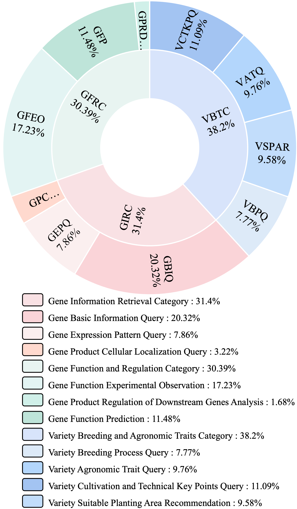

# SeedBench: A Multi-task Benchmark for Evaluating Large Language Models in Seed Science

Welcome to the official GitHub repository for **SeedBench**, the first multi-task benchmark designed to evaluate large language models (LLMs) in seed science, focusing on seed breeding. This repository includes the dataset, evaluation code, and documentation to support research in this domain.
---

## Overview

SeedBench assesses LLMs across three core seed breeding stages:
- **Gene Information Retrieval**
- **Gene Function and Regulation Analysis**
- **Variety Breeding with Agronomic Trait Optimization**
- 
  
*Figure 1: Breeding Expert Workflow Framework*

Built with domain experts, SeedBench features **2,264 expert-validated questions** across 11 task types and 10 subcategories, initially targeting rice breeding. Future updates will include other crops like maize, soybean, and wheat.

---

## Repository Contents

- `dataset/`: Full dataset.
  - `segments/`: 279 expert-curated text segments.
  - `questions/`: 2,264 questions across 10 subcategories.
  - `discarded_samples/`: Excluded samples for transparency.
- `code/`: Evaluation scripts.
  - `evaluate.py`: Main evaluation script.
  - `requirements.txt`: Dependencies.
- `docs/`: Prompt templates and appendices.
- `README.md`: This guide.

---

## Dataset Details

- **Corpus**: 308,727 publications cleaned to 1.1 billion tokens; 279 segments from 113 documents.
- **Questions**: 2,264 across 11 task types, bilingual (English/Chinese), expert-validated.
- **Focus**: Rice breeding as a representative case.

### Task Taxonomy

| Category                     | Subcategory                                 | Questions |
|------------------------------|---------------------------------------------|-----------|
| Gene Information Retrieval  | Gene Basic Information Query (C1)          | 258       |
|                              | Gene Expression Pattern Query (C2)         | 223       |
|                              | Gene Product Cellular Localization Query (C3) | 73     |
| Gene Function and Regulation| Gene Function Experimental Observation (C4)| 252       |
|                              | Gene Product Regulation Analysis (C5)      | 38        |
|                              | Gene Function Prediction (C6)              | 155       |
| Variety Breeding & Traits   | Variety Breeding Process Query (C7)        | 241       |
|                              | Variety Agronomic Trait Query (C8)         | 245       |
|                              | Variety Cultivation Key Points Query (C9)  | 279       |
|                              | Variety Suitable Planting Area Rec. (C10)  | 500       |

  
*Figure 2: Benchmark Taxonomy Distribution*

### Task Types and Metrics

| Type ID | Question Type              | Metric   | Count |
|---------|----------------------------|----------|-------|
| **Q&A** |                            |          |       |
| QA-1    | Multiple Choice            | Accuracy | 199   |
| QA-2    | Multiple Answer            | Macro-F1 | 186   |
| QA-3    | Fill-in-the-Blank          | ROUGE-L  | 223   |
| QA-4    | Generation                 | ROUGE-L  | 241   |
| **Summarization** |                  |          |       |
| SUM-1   | Simple Summarization       | ROUGE-L  | 224   |
| SUM-2   | Key Information Extraction | ROUGE-L  | 224   |
| **Reading Comprehension** |          |          |       |
| RC-1    | Multiple Choice            | Accuracy | 112   |
| RC-2    | Multiple Answer            | Macro-F1 | 107   |
| RC-3    | Fill-in-the-Blank          | ROUGE-L  | 220   |
| RC-4    | Generation                 | ROUGE-L  | 239   |
| RC-5    | Subcategory Classification | Accuracy | 278   |

*Table 1: Benchmark Task Types*

---

## Key Results

We evaluated 26 LLMs, including proprietary, open-source, and domain-specific models. Highlights:

### Performance by Subcategory

| Model             | C1   | C2   | C3   | C4   | C5   | C6   | C7   | C8   | C9   | C10  | Avg  |
|-------------------|------|------|------|------|------|------|------|------|------|------|------|
| GPT-4            | 59.59| 60.55| 76.32| 61.16| 56.34| 59.35| 63.67| 64.74| 60.65| 67.66| 62.06|
| DeepSeek-V3-671B | 56.03| 62.42| 74.81| 63.17| 55.23| 58.84| 68.23| 69.04| 66.46| 68.48| 63.30|
| Qwen2-72B        | 51.16| 58.10| 74.07| 59.72| 51.58| 57.76| 58.85| 61.63| 56.69| 59.11| 57.62|

*Table 5 (Excerpt): Evaluation of 26 LLMs on SeedBench Subcategories*  
- **Top Performers**: DeepSeek-V3-671B (63.30), GPT-4 (62.06).
- **Insight**: Larger models excel in complex tasks (C3, C10).

### Performance by Question Type (Zero-Shot)

| Model            | QA-1 | QA-2 | QA-3 | QA-4 | SUM-1 | SUM-2 | RC-1 | RC-2 | RC-3 | RC-4 | RC-5 | Avg  |
|------------------|------|------|------|------|-------|-------|------|------|------|------|------|------|
| GPT-4           | 60.50| 73.87| 21.35| 36.07| 58.73 | 62.89 | 100.00| 96.44| 87.86| 62.29| 86.74| 67.88|
| DeepSeek-V3     | 72.50| 79.84| 29.29| 40.63| 48.06 | 54.67 | 100.00| 97.22| 87.89| 55.19| 86.74| 68.37|
| Qwen2-72B       | 59.50| 75.98| 19.55| 31.62| 31.08 | 63.09 | 99.12 | 94.24| 72.20| 51.58| 89.96| 62.54|

*Table 6 (Excerpt): Zero-Shot Evaluation by Question Type*  
- **Top Performers**: DeepSeek-V3 (68.37), GPT-4 (67.88).
- **Insight**: High accuracy in multiple-choice tasks; generation tasks are challenging.

  
*Figure 6: Proprietary LLM Performance by Task Type*

  
*Figure 7: Open-Source LLM Performance by Task Type*

---

## Future Work

- Expand to maize, soybean, wheat.
- Add multimodal data (images, genomics).
- Explore advanced metrics (BERTScore, MoverScore).

---

## Contact

Open an issue on this repository for questions or contributions.

*Last Updated: March 30, 2025*  
*License: CC-BY 4.0, Apache 2.0, MIT*

---

### Notes
- **Images**: Assumes files are in `images/`. Update paths as needed.
- **Tables**: Condensed to key examples; full data in the paper.
- **Format**: Pure Markdown, optimized for GitHub readability.

# [GPL License](./LICENSE)

SeedBench is a benchmark suite for the seed/agriculture industry's LLM (Large Language Model) evaluation. It is designed to test the model's performance at two stages: pretraining and SFT (Supervised Fine-Tuning).
